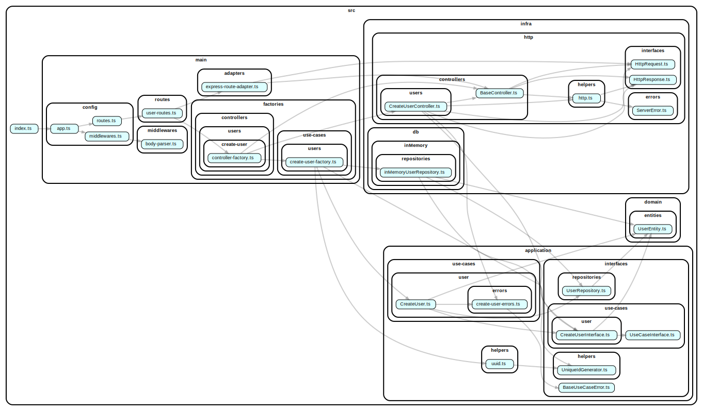

# ts-hexag

Basic project demonstrating how to use Hexagonal Architecture with Typescript.

## Dependency Graph

### Inspirations:

Trying to understand piece by piece. You will see a lot of copy and paste code.

- https://github.com/dyarleniber/simple-blog-application-backend-challenge
